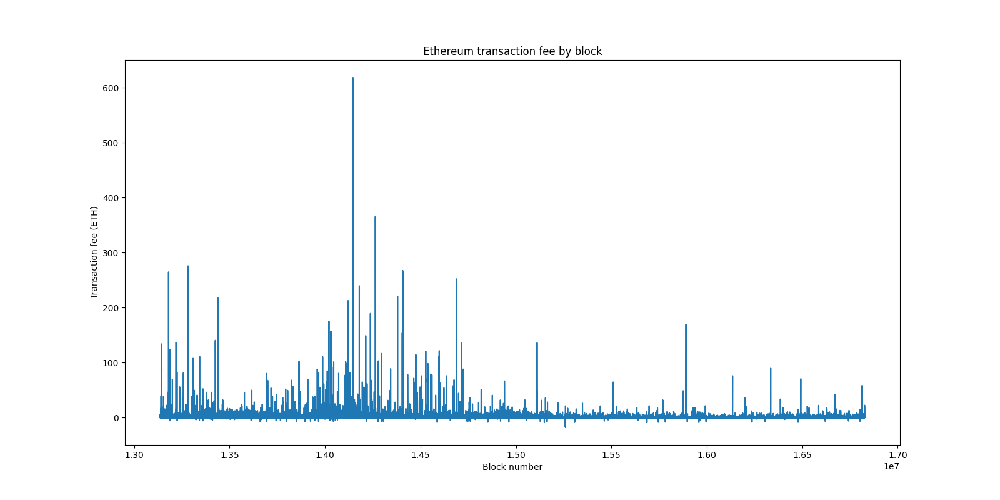
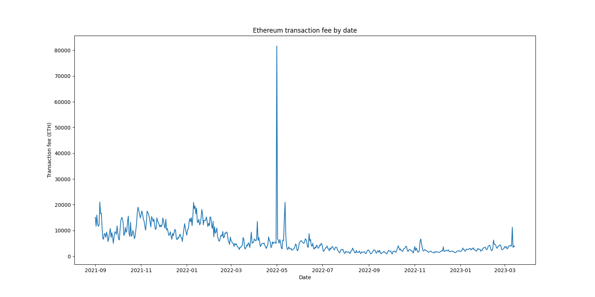
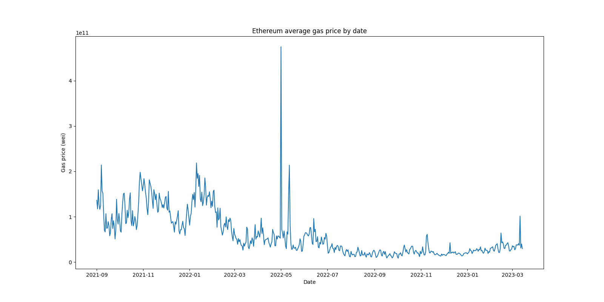
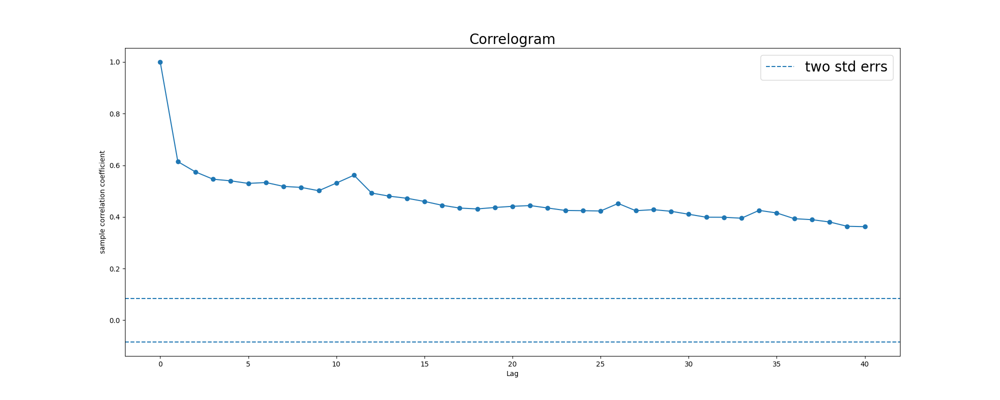

# Large-scale time series modeling of Ethereum transaction fees with AWS and PySpark
Author: Mingxuan (Ming) He  
Email:  mingxuanh@uchicago.edu

## Introduction
With the rising popularity of blockchain technologies and cryptocurrencies, there has been increasing interest from various social scientific disciplines to study the dynamics of blockchain ecosystems. As one of the core mechanisms of the blockchain economic system, transaction fee is a significant economic indicator, reflecting the supply and demand for block transactions and providing hints for the underlying costs and benefits of using cryptocurrencies as a median of exchange. I choose Ethereum, the largest proof-of-stake blockchain today and the second largest overall, as the main subject of analysis.

In this project, I build a large-scale computing and machine learning pipeline using AWS and PySpark to conduct time series modeling for transaction fees on the Ethereum blockchain. Due to the large volume of Ethereum transaction data (7200 blocks documenting ~1 million new public transactions every day), traditional analytical approaches are inadequate for handling this data. Large-scale and cloud computing tools enable me to analyze this immense dataset in a timely and cost-effective manner. I use AWS's EMR clusters to provide scalable computing power, and the PySpark framework for leveraging distributed processing capabilities and reproducibility.

This project is a milestone towards my thesis research, which focuses on **dynamic economic modeling for optimal cryptoeconomic policies**. In particular, the time series model parameters estimated here will enter my calibration process for a larger model on the macro-cryptoeconomy, and help dynamically optimizing protocol policies in the form of staking and burning (more details on [my personal website](https://sites.google.com/view/mingxuanhe/projects?authuser=0#h.7d9csc2ft4uk)).

## Data

Blockchain transactions data is publicly available from many sources. I choose the [**AWS Public Blockchain Data**](https://registry.opendata.aws/aws-public-blockchain/) available in the AWS Public Data Catalog. One benefit of using this data source is its great integrability with AWS tools. All data is accessible as compressed parquet files stored in a public S3 bucket (`s3://aws-public-blockchain`), which can be read into Spark directly. In addition, the database allows for querying data on different blockchains (Bitcoin and Ethereum) under the same environment, which is often difficult for raw blockchain data.

The datasets are partitioned by date. I select data from 09-01-2021 (first month after implementation of [EIP-1559: fee market change](https://eips.ethereum.org/EIPS/eip-1559)) to 04-01-2023*. More recent data is used as a benchmark for forecasting accuracy.   

\* *Note: This period covers "the Merge".*

## Implementation details

### Set up S3 and EMR Cluster: 
See [AWS_setup.ipynb](Code/AWS_setup.ipynb)  
* Initialize an EMR Cluster with 4 m5.xlarge EC2 instances and a S3 bucket for storage
* Configure the cluster to work with PySpark in the JupyterHub enviornment.
 
### Exploratory analysis and time series tests: 
See [Spark_EDA_TSTests.ipynb](Code/Spark_EDA_TSTests.ipynb)  
* Preprocessing: Load data from parquet, compute transaction fees from gas and gas price
* Exploratory analysis: plotting time series for transaction fee and gas price
* Time series tests: stationarity test and serial correlation test (functions implemented in [time_series_tests.py](Code/time_series_tests.py))

### Time series modeling pipeline with Spark ML: 
See [Spark_Pipeline_Modeling.ipynb](Code/Spark_Modeling_Pipeline.ipynb)
* Build pipeline for preprocessing & model estimation
* Model selection with cross validation
* Forecasting with May 2023 data

## Numerical results (more details in notebook)
### Time series plot: transaction fees by block and date

### Average gas price by date (in wei)

### Test for stationarity
Augmented Dickey-Fuller testing results (frequency=daily):  
| Statistic | Value |
| --- | --- |
| ADF Statistic | -2.293400 |
| p-value | 0.174105 |
| Critical Value (1%) | -3.4423174665535385 |
| Critical Value (5%) | -2.866818952732754 |
| Critical Value (10%) | -2.569581505602171 |

### Test for serial correlation with Ljung-Box Q statistic
Sample correlogram (frequency=daily)  

### Model training results with estimated parameters
- Block level
- Daily level
- different lags / suppress with lasso  
Begin with an AR(1) model with non-zero mean:  
$\varphi_t = c + \rho \cdot \varphi_{t-1} + \varepsilon_t$

### Forecasting performance
Apr 2023 data

## References

* Ethereum Development Documentation. Gas and Fees. https://ethereum.org/en/developers/docs/gas
* Biais, B., Bisiere, C., Bouvard, M., Casamatta, C., & Menkveld, A. J. (2020). Equilibrium bitcoin pricing. The Journal of Finance. https://doi.org/10.1111/jofi.13206  
* Hayashi, F. (2011). Econometrics. Ch. 2.10, Testing for Serial Correlation. Princeton University Press.
* Registry of Open Data on AWS: AWS Public Blockchain Data. https://registry.opendata.aws/aws-public-blockchain/  
* AWS Public Blockchain Data: Bitcoin and Ethereum Blockchain Data. https://github.com/aws-solutions-library-samples/guidance-for-digital-assets-on-aws/tree/main/analytics
* Vinay Raman. Time-series forecasting using Spark ML: Part-2. https://medium.com/analytics-vidhya/time-series-forecasting-using-spark-ml-part-2-31506514c643
* Jay Luan. A Deep Dive into Custom Spark Transformers for Machine Learning Pipelines. https://www.crowdstrike.com/blog/deep-dive-into-custom-spark-transformers-for-machine-learning-pipelines/
## Miscellaneous

This project is submitted as the final project for MACS-30123 Large Scale Computing for the Social Sciences, taught by Prof. Jon Clindaniel in Spring 2023. Huge thanks to Jon and the TAs for all the help related to class material and this project.